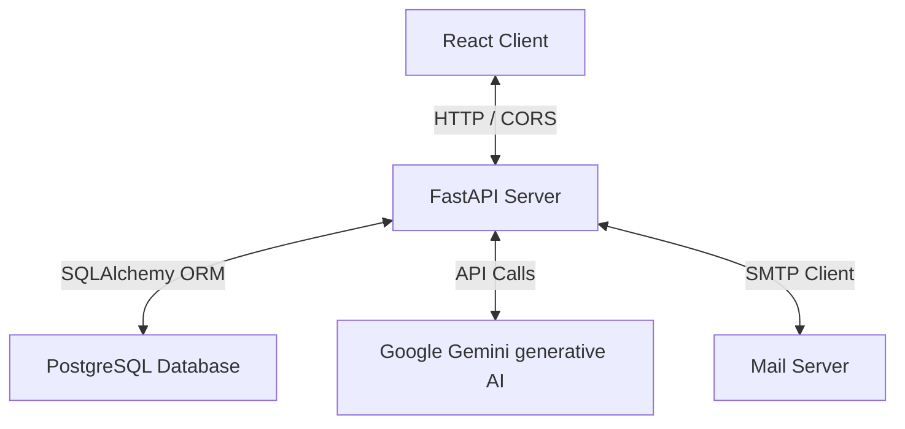
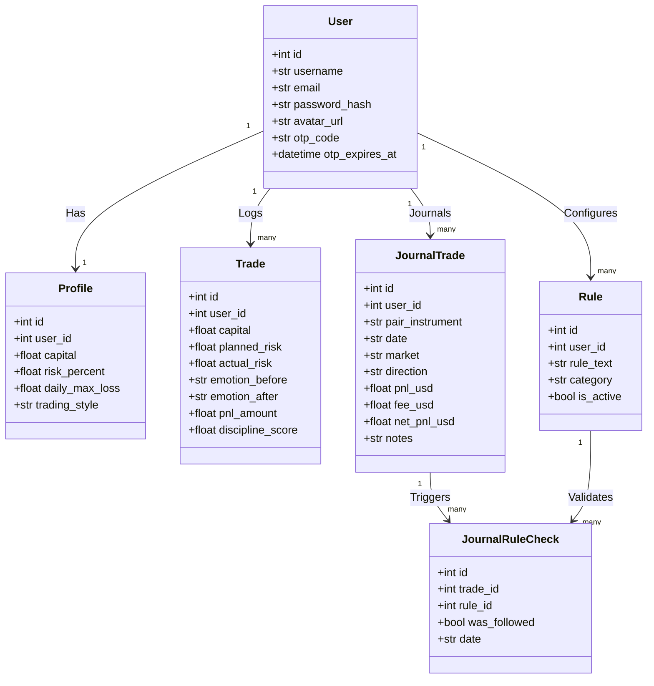

# BehaviorEdge — AI-Based Behavioral Risk Regulation Platform for Traders

BehaviorEdge is a premium, full-stack trading journal and behavioral analytics dashboard. It monitors trading discipline, detects biases, provides AI-driven coaching (via Google Gemini API), and regulates risk parameters dynamically.

---

## 🏗️ Architecture Overview

The system is built as a decoupled full-stack application:



### 1. Frontend Client
* **Tech Stack:** React 19, Vite, Tailwind CSS, Lucide Icons, Recharts, PapaParse, SheetJS (`xlsx`).
* **Key Components:**
  * **Dashboard:** Core performance cards, streaks, win-rate, profit factor, and interactive Recharts performance curves.
  * **Trade Logger / Workspace:** Table with multi-faceted advanced search filters (Markets, Outcome, Direction, Sessions, Date range) and direct Excel/CSV statement imports.
  * **AI Coach:** Interactive chat console powered by Generative AI analyzing your emotional context and discipline records.
  * **Profile & Risk Profile Settings:** Core parameters configuration (capital, max daily loss, style, confluence model weights).

### 2. Backend API Server
* **Tech Stack:** FastAPI, Uvicorn, SQLAlchemy ORM, Pydantic validations, Python-jose (JWT), Passlib (Bcrypt), Python-multipart (FileUploads).
* **Core Modules:**
  * `auth.py`: JWT-based user signups, logins, and OTP email forgot password reset flows.
  * `trades.py` & `journal_trades.py`: Dual-synchronized trade management.
  * `profile.py`: Profile updates, location/twitter metadata, and static avatar file uploads.
  * `scoring.py`: Algorithmic evaluation of discipline score, Risk Discipline Index (RDI), Emotional Volatility Index (EVI), and cognitive biases.

---

## 🗄️ Database Models & Relationships

All tables are managed programmatically via SQLAlchemy and synchronized using auto-migrations on system startup:



---

## 🌟 Key Features & Custom Implementations

### 1. Proportional Dhan Excel P&L Importer
* **File:** `AllTradesTable.jsx`
* Enables direct drag-and-drop / selector uploading of binary `.xls` and `.xlsx` Profit & Loss statements exported from Dhan broker.
* **Proportional Charges Distribution:** Extracts the segment-level `Total Charges` (brokerage, GST, STT, exchange fees, stamp duty) from the sheet's top summary block. Automatically counts trades parsed under each segment (Equity, F&O, Commodities) and divides total charges equally as a negative `fee_usd` per trade, keeping Net PnL and outcome status 100% accurate.

### 2. Dual-Sync Delete Mechanism
* **Files:** `journal_trades.py` & `trades.py`
* Resolves the "deleted trades reappear" sync loop. Now, deleting a trade record from the Journal (`journal_trades` table) automatically identifies and sweeps the corresponding entry in the core platform `trades` table. This prevents the retroactive trade book importer from re-creating the log on subsequent listings.

### 3. Password Reset OTP Flow
* **File:** `auth.py`
* A robust, double-verification forgotten password reset flow. Generates a secure, cryptographically random 6-digit numeric OTP with a 15-minute expiration period, emails it securely to the user via a Resend / SMTP service, validates the token, and updates password hashes safely using Bcrypt.

### 4. Layout & Stacking Context Upgrades
* **Files:** `index.css`, `Profile.jsx`, `AllTradesTable.jsx`
* Implemented clean flex containers, touch scroll locks (`touch-action: pan-y`), and standardized viewport heights (`min-h-screen`) to prevent content overflows on small mobile screens.
* Modals utilize elevated stacking contexts (`z-index: 50+`) to guarantee click intercepts are not blocked by underlying relative components.

---

## 🚀 How to Run the Project Locally

### 1. Backend Server Setup
1. Navigate to the backend directory:
   ```bash
   cd backend
   ```
2. Create and activate a Python virtual environment:
   ```bash
   python -m venv venv
   venv\Scripts\activate   # Windows
   source venv/bin/activate  # macOS/Linux
   ```
3. Install required packages:
   ```bash
   pip install -r requirements.txt
   ```
4. Create a `.env` file in the `backend/` directory:
   ```env
   DATABASE_URL=postgresql://postgres:<password>@localhost:5432/behavioredge
   SECRET_KEY=<your-jwt-secret>
   GEMINI_API_KEY=<your-gemini-api-key>
   RESEND_API_KEY=<your-resend-api-key> # Optional, falls back to SMTP console log
   ```
5. Run the server:
   ```bash
   uvicorn main:app --reload
   ```
   The backend will be running at `http://localhost:8000`. API documentation is available at `http://localhost:8000/docs`.

### 2. Frontend Client Setup
1. Navigate to the frontend directory:
   ```bash
   cd ../frontend
   ```
2. Install npm dependencies:
   ```bash
   npm install
   ```
3. Run the development server:
   ```bash
   npm run dev
   ```
   The application will be accessible at `http://localhost:5173`.
