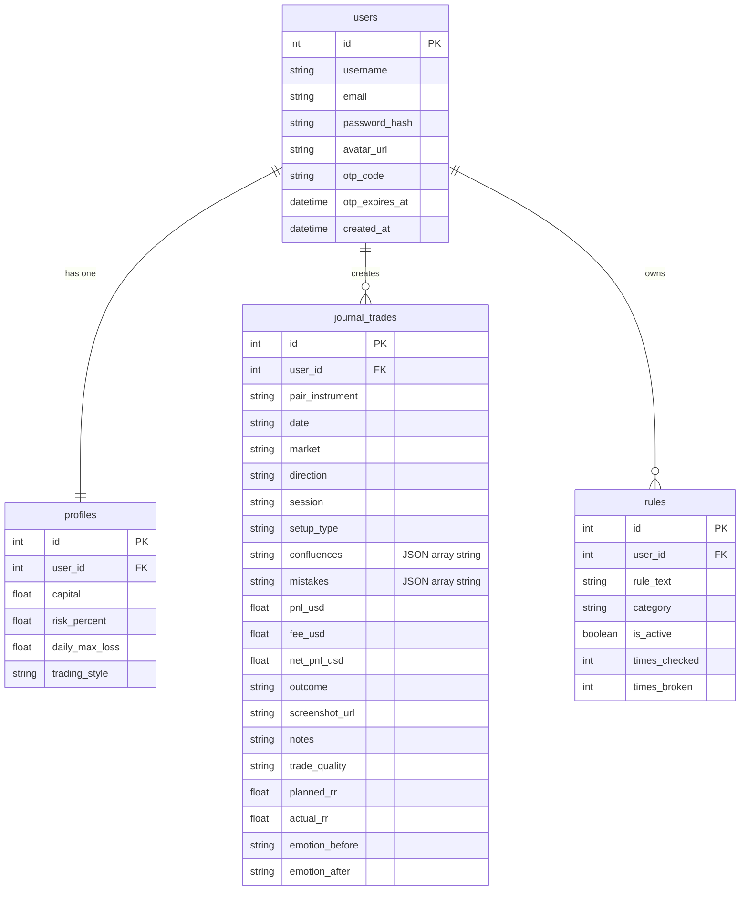
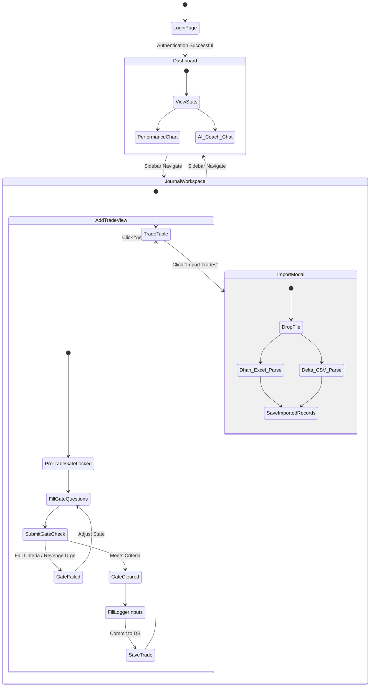

# BehaviorEdge — Product Requirements, Technical Specifications, and UI/UX Design System Manual

---

## 📋 Part 1: Product Requirements Document (PRD)

### 1. Vision & Objectives
BehaviorEdge is a real-time trading journal and risk-regulation platform designed to address the psychological pitfalls of retail trading (e.g., revenge trading, size-doubling, over-trading, and lack of system compliance). 
By integrating a **Pre-Trade Psychological Gate** directly into the logging workflow, the system acts as a circuit breaker, preventing trades from being registered if the trader's emotional state or rule compliance checks indicate high risk.

### 2. Core Value Pillars
* **Behavioral Self-Regulation:** Forces users to review rules and analyze emotions *before* putting capital at risk.
* **Algorithmic Analytics:** Translates trading statistics into cognitive performance indicators (Discipline Score, Emotional Volatility Index, Risk Discipline Index).
* **AI Behavioral Coach:** Leverages LLMs to inspect past trades and offer tailored advice based on logged emotions and mistakes.

### 3. Functional Requirements

#### A. Pre-Trade Gate
* **Psychological Assessment Form:** Dropdown of emotional states, setup confidence range (1-10), and yes/no gate questions (revenge urge, criteria compliance).
* **Rule Checklist:** Requires the user to tick off active rules before the logger unlocks.
* **Approval/Block Verdict:** Algorithmic verdict mapping block flags and triggering Gemini AI summaries.

#### B. Trade Logger
* **Manual Data Fields:** Pair/Instrument, date, market type (Crypto, Forex, Stocks, Options), direction (Long/Short), session, setup types, confluences, mistakes, gross PnL, trading fees.
* **Binary Statement Importer:** Supports drag-and-drop / select-upload of Delta Exchange CSV and Dhan P&L Excel statements (`.xls`/`.xlsx`).

#### C. Dashboard & Visualizations
* **Performance Indicators:** Profit Factor, Win Rate, Total Net PnL, Long vs. Short, Active Streak.
* **Recharts Visualizations:** Performance curves (Net Cumulative PnL), daily PnL breakdown, and dynamic gauges (Discipline Score).

#### D. Operational Settings & Rules
* **Risk Profile:** Initial capital, risk parameters (Risk % per trade, Max Daily Loss limit).
* **Dynamic Rule Checklist:** Add/delete/toggle system operating rules.

---

## 🛠️ Part 2: Technical Requirements Document (TRD)

### 1. Technology Stack
* **Frontend:** React 19 (compiled via Vite 7), Tailwind CSS 4, Recharts, Lucide Icons, PapaParse (CSV parser), SheetJS (`xlsx` Excel parser).
* **Backend:** FastAPI, Uvicorn, SQLAlchemy ORM (SQLite for local, PostgreSQL for production), Python-Jose (JWT), Passlib + Bcrypt.
* **Integrations:** Google Gemini AI API, Resend (SMTP OTP delivery).

### 2. Database Schema Definition



### 3. Core API Architecture & Routes

#### Authentication (`/api/auth`)
* `POST /signup`: Register a new user profile.
* `POST /login`: Generate JWT access tokens.
* `POST /forgot-password`: Dispatch a 6-digit verification code to the registered email address.
* `POST /verify-otp` & `POST /reset-password`: Confirm OTP and overwrite database hash credentials.

#### Trade Journal (`/api/journal/trades`)
* `GET /`: Retrieve all journal records with active filters.
* `POST /trades`: Log a trade. Converts frontend payload lists to database JSON string lists.
* `PUT /trades/{trade_id}` & `DELETE /trades/{trade_id}`: Edit or delete records.
  > [!NOTE]
  > Deleting a journal record triggers a cascade deletion that clears corresponding statistics records in the platform-wide `trades` table.

#### Behavioral Analyst & Coach (`/api/coach`)
* `POST /pre-trade`: Core decision engine verifying gate parameters. Runs LLM prompts.
* `POST /chat`: Dynamic message board enabling conversation with the Gemini coach.

### 4. Behavioral Metrics Algorithms

#### A. Discipline Score
$$Discipline\ Score = 100 \times \left( \frac{\text{Followed Rules}}{\text{Total Rules Verified}} \right) - (20 \times \text{Mistakes Count})$$

#### B. Risk Discipline Index (RDI)
Evaluates the deviation of actual risk from planned risk:
$$RDI = 1 - \frac{|Actual\ Risk\% - Planned\ Risk\%|}{Planned\ Risk\%}$$
* $RDI \approx 1$: Perfect risk discipline.
* $RDI < 0.5$: Erratic position sizing.

---

## 🔄 Part 3: App Flow & Navigation Mapping



---

## 🎨 Part 4: UI/UX Guidelines & Design System

### 1. Typography & Grid Structure
* **Google Fonts:**
  * Header/Hero Titles: `'Instrument Serif'`, Georgia, serif (elegant, editorial styling).
  * Body/Text: `'Inter'`, sans-serif (clean, high-density readability).
  * Codes/Values: `'JetBrains Mono'`, monospace (alignment of metrics, currency values).
* **Grid Alignments:** Standardized 8px padding system, CSS columns mapping to 7/8 columns (filters), flex containers containing strict viewport sizing (`touch-action: pan-y` on mobile tables).

### 2. Custom CSS Variable Palette
```css
:root {
  --bg-base:       #07050f;   /* Dark purple canvas */
  --bg-card:       #0e0b18;   /* Elevated cards background */
  --bg-elevated:   #151020;   /* Dropdowns/Inputs background */
  --border:        #1f1535;   /* Baseline grid dividers */
  --border-bright: #2e1f52;   /* Interactive outlines */
  --accent:        #7c3aed;   /* Brand purple tint */
  --accent-light:  #a78bfa;   /* Secondary purple glow */
  --green:         #10b981;   /* Wins / Gate Clear / Safe */
  --red:           #f43f5e;   /* Losses / Gate Blocks / Danger */
  --amber:         #f59e0b;   /* Warning indicators */
  --pink:          #e11d75;   /* Visual gradients accent */
}
```

### 3. Glassmorphic Micro-Interactions
* **Glow Cards (`GlowCard.jsx`):** Renders transparent backdrops (`backdrop-blur-md`) layered over dynamic radial gradient shadows reflecting user outcomes:
  ```javascript
  // Dynamic glow border color matching outcomes
  const glowShadow = glowColor === 'green' 
    ? 'rgba(16, 185, 129, 0.18)' 
    : glowColor === 'red' 
      ? 'rgba(244, 63, 94, 0.18)' 
      : 'rgba(124, 58, 237, 0.18)';
  ```
* **SVG Bounding Boxes:** Filters (`feGaussianBlur`) contain wide coordinate pads (`x="-100%" y="-100%" width="300%" height="300%"`) to eliminate clipping margins on charting dots.
* **Transitions:** Linear-ease animations (`transition: all 0.2s`) mapped to active buttons, checkbox states, and row deletions.
