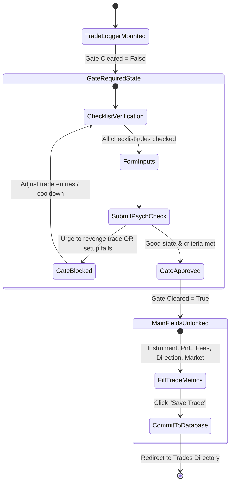

# BehaviorEdge — Comprehensive System Specification Manual
## Product Requirements (PRD), Technical Specifications (TRD), App Flow, and UI/UX Design System Guidelines

---

## 📋 Part 1: Product Requirements Document (PRD)

### 1. Vision & Objectives
Retail trading is plagued by psychological pitfalls: FOMO (Fear of Missing Out), revenge trading, emotional over-leveraging (size-doubling), and a lack of system compliance. BehaviorEdge addresses these challenges by transforming the standard trading journal from a passive logbook into an active, **psychological risk-regulation circuit breaker**.

By requiring traders to pass a **Pre-Trade Psychological Gate** before logging a trade, the application actively prevents self-destructive behaviors at the point of execution. Integrating algorithmic metrics like the Discipline Score, Risk Discipline Index (RDI), and Emotional Volatility Index (EVI) allows the platform to build a comprehensive risk profile, which is analyzed by a generative **AI Behavioral Coach** (Gemini API) to deliver real-time, personalized interventions.

---

### 2. User Roles & Personas
* **Day Trader (Equity/Options):** Needs rapid entry logging, automated charges tracking, and immediate risk checks. Typically prone to over-trading and revenge trading.
* **Swing Trader (Crypto/Forex):** Needs detailed confluence tracking, screenshots mapping, and weekly analytics reviews to evaluate structural strategy compliance.
* **Risk Manager (System Administrator):** Configures baseline rules, system-wide weights, and verifies platform data integrity.

---

### 3. Functional Requirements Checklist

| Feature ID | Category | Feature Name | Description | Priority |
| :--- | :--- | :--- | :--- | :--- |
| **FR-01** | Auth | Two-Factor OTP Reset | Allows forgotten passwords to be reset using a 6-digit email OTP (SMTP/Resend) on the local database level, while primary login session authentication relies on the Supabase client. | High |
| **FR-02** | Gate | Psychological Check | Multi-input checklist, emotional self-report, and setup confidence index slider. | Critical |
| **FR-03** | Gate | Decision Engine | Algorithmic gate evaluation: blocks trade if revenge trading is detected or rules are unsatisfied. | Critical |
| **FR-04** | Log | Manual Trade Entry | Logs pair, market, direction, session, setup type, confluences, mistakes, gross P&L, and fees. | High |
| **FR-05** | Log | Statement Importer | Auto-detects and imports closed-position records from Dhan Excel sheets (.xls, .xlsx). (Note: Delta Exchange CSV statements are planned but not currently implemented in the frontend client). | High |
| **FR-06** | Log | Fee Distribution | Dynamically divides segment-level charges equally across all imported trades. | High |
| **FR-07** | Stats | Analytics Dashboard | Computes Win Rate, Profit Factor, Cumulative PnL, and current streaks. | High |
| **FR-08** | Coach | AI Coach Chat | Direct prompt interface allowing conversation with the AI coach. | Medium |
| **FR-09** | Settings | System Settings | Toggles operating rules, sets baseline capital, and adjusts confluence weights. | High |

---

### 4. Detailed User Flow Scenarios

#### Scenario A: Logging a Manual Trade with Pre-Trade Clearance
1. The user navigates to the **Trade Logger** view. The form is disabled, showing a locked banner: `⚠️ GATE REQUIRED`.
2. The user fills out the checklist of rules and selects their emotional state (*"Fearful"*) and setup confidence (*"6/10"*).
3. The user answers: *"Trading to recover a recent loss? No"* and *"Setup meets all entry criteria? Yes"*.
4. The user clicks **"Run Pre-Trade Psychological Check"**.
5. The backend validates the inputs. Since the confidence is low and emotion indicates stress, the AI Coach returns warning suggestions but approves the entry because no strict gate blocks (revenge trading) were triggered.
6. The banner changes to `✅ GATE CLEARED` in emerald green, and the main logger fields are enabled.
7. The user enters trade details (BTCUSD, Long, $350 PnL, $10 Fees) and saves the entry.
8. The system updates stats and redirects to the **Trades Directory** table.

#### Scenario B: Importing Dhan Excel Statement
1. The user goes to the **Trades Directory** table page and clicks **📂 Import Trades**.
2. The user drops a binary `PNL_REPORT.xls` file.
3. The client-side parser reads the binary spreadsheet, detects the `"dhan.co"` header signature, parses the summary table to calculate total segment charges, parses individual trade rows, divides charges proportionally, checks for database duplicates, and pushes the records to the backend DB.
4. The system updates stats and refreshes the ledger, displaying the new entries grouped by Stocks and Options.

---

## 🛠️ Part 2: Technical Requirements Document (TRD)

### 1. Architectural Architecture
BehaviorEdge utilizes a decoupled client-server hybrid architecture:

```
[React App (Vite 7)] <────────────────────────────────> [Supabase Auth (JWT Provider)]
       │                                                          │
       │ (CORS HTTPS / API Requests + Supabase JWT)               │ (JWKS Token Public Keys)
       ▼                                                          ▼
[FastAPI Server (Uvicorn)] <──────────────────────────────────────┘
       │
       ├─► SQLAlchemy ORM <─► [PostgreSQL / SQLite]
       ├─► SMTP / Resend API (Email OTP)
       ├─► Google Gemini Generative API (AI Coach)
       └─► XLSX / SheetJS (Local Binary Dhan Spreadsheet Parsers)
```

---

### 2. Comprehensive Database Schema Dictionary

#### Table 1: `users`
Stores user authentication details and extended profile metadata.
* `id` (INTEGER, Primary Key, Auto-Increment)
* `username` (VARCHAR, Unique, Indexed)
* `email` (VARCHAR, Unique, Indexed)
* `password_hash` (VARCHAR, Nullable) -- Stored for custom local backend password setups
* `supabase_id` (VARCHAR, Unique, Indexed, Nullable) -- Primary UUID mapping to Supabase session store
* `full_name` (VARCHAR, Nullable)
* `bio` (TEXT, Nullable)
* `avatar_url` (VARCHAR, Nullable)
* `location` (VARCHAR, Nullable)
* `website` (VARCHAR, Nullable)
* `twitter` (VARCHAR, Nullable)
* `experience_level` (VARCHAR, Default: `"Intermediate"`)
* `otp_code` (VARCHAR(6), Nullable)
* `otp_expires_at` (TIMESTAMP, Nullable)
* `subscription_tier` (VARCHAR, Default: `"free"`)
* `created_at` (TIMESTAMP, Default: UTC Now)

#### Table 2: `profiles`
Stores risk parameters and capital settings.
* `id` (INTEGER, Primary Key, Auto-Increment)
* `user_id` (INTEGER, ForeignKey: `users.id`)
* `capital` (FLOAT, Default: `10000.0`)
* `risk_percent` (FLOAT, Default: `1.0`)
* `daily_max_loss` (FLOAT, Default: `300.0`)
* `trading_style` (VARCHAR, Default: `"Day Trading"`)

#### Table 3: `trades` (Core stats table)
Tracks primary trade entries for algorithmic risk evaluations.
* `id` (INTEGER, Primary Key, Auto-Increment)
* `user_id` (INTEGER, ForeignKey: `users.id`)
* `timestamp` (TIMESTAMP, Default: UTC Now)
* `capital` (FLOAT)
* `risk_percent` (FLOAT)
* `planned_risk` (FLOAT)
* `actual_risk` (FLOAT)
* `emotion_before` (VARCHAR)
* `emotion_after` (VARCHAR)
* `rule_followed` (BOOLEAN)
* `outcome` (VARCHAR)
* `pnl_amount` (FLOAT, Default: `0.0`)
* `rdi` (FLOAT)
* `evi` (FLOAT)
* `discipline_score` (FLOAT)
* `daily_loss` (FLOAT)
* `violations` (TEXT)
* `pre_trade_approved` (BOOLEAN)

#### Table 4: `journal_trades` (Detailed journal records table)
Stores detailed metrics for manual logs and statements imports.
* `id` (INTEGER, Primary Key, Auto-Increment)
* `user_id` (INTEGER, ForeignKey: `users.id`)
* `pair_instrument` (VARCHAR)
* `date` (VARCHAR, Format: `YYYY-MM-DD`)
* `market` (VARCHAR, Default: `"Crypto"`)
* `direction` (VARCHAR, e.g., `"Long"`, `"Short"`)
* `session` (VARCHAR, Default: `""`)
* `setup_type` (VARCHAR, Default: `""`)
* `confluences` (TEXT, JSON-serialized array, Default: `"[]"`)
* `mistakes` (TEXT, JSON-serialized array, Default: `"[]"`)
* `pnl_usd` (FLOAT, Default: `0.0`)
* `fee_usd` (FLOAT, Default: `0.0`)
* `net_pnl_usd` (FLOAT, Default: `0.0`)
* `net_daily_amount_usd` (FLOAT, Default: `0.0`)
* `outcome` (VARCHAR, Default: `"Breakeven"`)
* `screenshot_url` (VARCHAR, Default: `""`)
* `notes` (TEXT, Default: `""`)
* `trade_quality` (VARCHAR, Default: `""`)
* `planned_rr` (FLOAT, Default: `0.0`)
* `actual_rr` (FLOAT, Default: `0.0`)
* `rules_followed_count` (INTEGER, Default: `0`)
* `rules_broken_count` (INTEGER, Default: `0`)
* `emotion_before` (VARCHAR, Default: `"Neutral"`)
* `emotion_after` (VARCHAR, Default: `"Neutral"`)
* `created_at` (TIMESTAMP, Default: UTC Now)

#### Table 5: `rules`
System checklist operating rules.
* `id` (INTEGER, Primary Key, Auto-Increment)
* `user_id` (INTEGER, ForeignKey: `users.id`)
* `rule_text` (TEXT)
* `category` (VARCHAR, Default: `"General"`)
* `is_active` (BOOLEAN, Default: `TRUE`)
* `times_checked` (INTEGER, Default: `0`)
* `times_broken` (INTEGER, Default: `0`)
* `created_at` (TIMESTAMP, Default: UTC Now)

#### Table 6: `journal_rule_checks`
Maps check outcomes for rules validated against journal entries.
* `id` (INTEGER, Primary Key, Auto-Increment)
* `trade_id` (INTEGER, ForeignKey: `journal_trades.id` on cascade delete)
* `rule_id` (INTEGER, ForeignKey: `rules.id` on cascade delete)
* `was_followed` (BOOLEAN, Default: `TRUE`)
* `date` (VARCHAR, Format: `YYYY-MM-DD`)
* `created_at` (TIMESTAMP, Default: UTC Now)

---

### 2.5 Hybrid Authentication & Token Verification Flow
BehaviorEdge operates on a hybrid authentication model:
* **Frontend Authentication:** Handled exclusively via the Supabase Client SDK (`@supabase/supabase-js`). Upon login or OAuth (Google), Supabase issues a JWT access token.
* **API Middleware Verification:** The Axios client interceptor attaches the Supabase JWT token in the `Authorization: Bearer <token>` header of all requests.
* **FastAPI Backend Decoder (`dependencies.get_current_user`):**
  * Reads the JWT header algorithm (`alg`).
  * If the token uses `HS256`, it decodes it symmetrically using the local `SUPABASE_JWT_SECRET`.
  * If the token uses an asymmetric signature (e.g. `RS256`), it fetches public keys from Supabase's public JWKS endpoint (`https://<project>.supabase.co/auth/v1/.well-known/jwks.json`), caches them for 30 minutes, and performs signature verification.
  * Extracted `sub` claim maps to `User.supabase_id`. If a user with this ID does not exist in the local SQL database, a local record is automatically provisioned and seeded with 8 default rules.
* **Legacy Backend Auth Routes:** The backend maintains traditional local username/password endpoints (`/auth/signup`, `/auth/login`, `/auth/google-login`) and custom OTP password reset flows (`/auth/forgot-password`, `/auth/verify-otp`, `/auth/reset-password`), but these are bypassed by the React client.

---

### 3. API Specifications & Payload Schemas

#### A. Pre-Trade Check Endpoint (`POST /api/coach/pre-trade`)
* **Request Payload Schema:**
  ```json
  {
    "emotion": "string",
    "confidence": 0,
    "revenge_urge": true,
    "setup_validated": true,
    "checked_rules": {
      "rule_id_1": true,
      "rule_id_2": false
    }
  }
  ```
* **Response Payload Schema:**
  ```json
  {
    "approved": true,
    "block_reasons": ["string"],
    "ai_assessment": "string"
  }
  ```

#### B. Trade Record Logging Endpoint (`POST /api/journal/trades`)
* **Request Payload Schema:**
  ```json
  {
    "pair_instrument": "string",
    "date": "YYYY-MM-DD",
    "market": "string",
    "direction": "string",
    "session": "string",
    "setup_type": "string",
    "confluences": ["string"],
    "mistakes": ["string"],
    "pnl_usd": 0.0,
    "fee_usd": 0.0,
    "net_pnl_usd": 0.0,
    "net_daily_amount_usd": 0.0,
    "outcome": "string",
    "screenshot_url": "string",
    "notes": "string"
  }
  ```
* **Response Payload Schema (201 Created):**
  ```json
  {
    "id": 0,
    "pair_instrument": "string",
    "date": "YYYY-MM-DD",
    "market": "string",
    "direction": "string",
    "session": "string",
    "setup_type": "string",
    "confluences": ["string"],
    "mistakes": ["string"],
    "pnl_usd": 0.0,
    "fee_usd": 0.0,
    "net_pnl_usd": 0.0,
    "net_daily_amount_usd": 0.0,
    "outcome": "string",
    "screenshot_url": "string",
    "notes": "string",
    "rules_followed_count": 0,
    "rules_broken_count": 0,
    "emotion_before": "string",
    "emotion_after": "string",
    "created_at": "ISO-8601-Timestamp"
  }
  ```

---

### 4. Behavioral Analytics Algorithms

#### A. Algorithmic Discipline Score
The Discipline Score indicates how consistently a user adheres to their trading system rules and handles emotional trading mistakes:
$$Discipline\ Score = 100 \times \left( \frac{\text{Followed Rules}}{\text{Total Rules Verified}} \right) - (20 \times \text{Mistakes Count})$$
* **Deductions:** Each mistake (e.g., FOMO, over-leveraged, early exit) incurs a strict **20-point deduction**.
* **Normalization:** The final score is bound to a range of $[0, 100]$.

#### B. Emotional Volatility Index (EVI)
Measures emotional variance during entry decisions over a rolling window of $N$ trades. Each logged emotion is mapped to a weight:
* *Calm, Focused, Confident* = `1.0` (Low Emotional Stress)
* *Hopeful, Excited, Hesitant* = `2.0` (Medium Emotional Stress)
* *Anxious, Fearful, Greedy, Angry* = `4.0` (High Emotional Stress)

$$\text{Emotion Mean } (\mu) = \frac{1}{N} \sum_{i=1}^{N} \text{Weight}_i$$
$$EVI = \sqrt{\frac{1}{N} \sum_{i=1}^{N} (\text{Weight}_i - \mu)^2}$$

#### C. Risk Discipline Index (RDI)
Evaluates compliance with the user's defined risk parameters. If a trader plans to risk $1\%$ per trade, but risks $3\%$ in practice, the RDI penalizes the variance:
$$RDI = 1 - \frac{|Actual\ Risk\% - Planned\ Risk\%|}{Planned\ Risk\%}$$
* If $RDI \ge 0.8$: Green status (High risk discipline).
* If $0.5 \le RDI < 0.8$: Amber status (Moderate variance).
* If $RDI < 0.5$: Red status (Extreme risk variance; triggers blocking flags).

---

## 🔄 Part 3: App Flow & Navigation Mapping

```
                                  [Login / OTP Password View]
                                               |
                                     (Successful JWT Auth)
                                               |
                                               v
                                      [Sidebar Navigation]
                                               |
        +----------------------+---------------+---------------+----------------------+
        |                      |                               |                      |
        v                      v                               v                      v
[Dashboard View]      [Trades Ledger]                 [Rules Directory]       [Position Calculator]
- Profit Factor       - Advanced Filter Panel         - Rule Checklist CRUD   - Planned Size
- Cumulative PnL      - Import statement modal        - Times Checked/Broken  - R:R Calculations
- Discipline Gauge    - Add Trade Form (Locked Gate)  - Category Mapping      - Leverage Config
```

### State Flow: Logging a New Trade


---

## 🎨 Part 4: UI/UX Guidelines & Design System

### 1. The Glassmorphism Theme
BehaviorEdge implements a premium, clean layout with glassmorphic accents layered over deep space-purple tones:
* **Base styling:** `background-color: #07050f;` overlayed with a subtle purple layout grid (`rgba(124, 58, 237, 0.04)` line segments spaced at 40px).
* **Radial highlights:** Radial blur lights positioned at top-right and bottom-left to introduce subtle visual depth.
* **Component cards:** Built using `GlowCard.jsx` wrappers that leverage a semi-translucent backdrop (`background: rgba(14, 11, 24, 0.65); backdrop-filter: blur(10px);`) and outcome-matched glowing shadows:
  ```css
  box-shadow: 0 0 40px 0 rgba(var(--glow-color-rgb), 0.15);
  ```

### 2. Core Color Tokens & Custom Palettes

#### A. CSS Variable Variables (`index.css`)
```css
:root {
  /* Layout canvases */
  --bg-base:       #07050f;   /* Main background canvas */
  --bg-card:       #0e0b18;   /* Component panel background */
  --bg-elevated:   #151020;   /* Selected input textareas */
  
  /* Dividers & Borders */
  --border:        #1f1535;   /* Normal line grid dividers */
  --border-bright: #2e1f52;   /* Focus and active border highlights */
  
  /* Brand Tints & Statuses */
  --accent:        #7c3aed;   /* Primary Purple (Buttons, active icons) */
  --accent-light:  #a78bfa;   /* Secondary light purple */
  --green:         #10b981;   /* Wins / Gate Cleared (Safe) */
  --red:           #f43f5e;   /* Losses / Gate Blocked (Danger) */
  --amber:         #f59e0b;   /* Warnings / Gate Required (Caution) */
  --pink:          #e11d75;   /* Hot pink gradient accents */
  
  /* High-Contrast Texts */
  --text-primary:  #f0ecff;   /* Primary headers & text */
  --text-secondary:#c8c0e0;   /* Muted captions & labels */
  --text-muted:    #6e6294;   /* Low-contrast details */
}
```

#### B. Dynamic Opacity Glow Palettes
The interface applies semi-transparent gradients to evoke glowing card boundaries and status tags. These are constructed locally or in Tailwind as follows:

| CSS Variable | Base HEX | Opacity | Computed Value | Application Place |
| :--- | :--- | :--- | :--- | :--- |
| `var(--accent-glow)` | `#7c3aed` | `18%` | `rgba(124, 58, 237, 0.18)` | Secondary halo and button indicators. |
| `var(--accent-dim)` | `#7c3aed` | `7%` | `rgba(124, 58, 237, 0.07)` | Internal card block fills. |
| `var(--green-glow)` | `#10b981` | `15%` | `rgba(16, 185, 129, 0.15)` | Positive P&L backgrounds & Approved banner. |
| `var(--red-glow)` | `#f43f5e` | `15%` | `rgba(244, 63, 94, 0.15)` | Negative P&L backgrounds & Warning banner. |
| `var(--pink-glow)` | `#e11d75` | `35%` | `rgba(225, 29, 117, 0.35)` | Neon hot pink buttons overlay halo. |
| `var(--pink-dim)` | `#e11d75` | `12%` | `rgba(225, 29, 117, 0.12)` | Inactive highlight borders. |

---

### 3. Psychological Gate Emotion Mappings
In the **Pre-Trade Psychological Gate** (`TradeLogger.jsx`), raw emotions are evaluated against specific color tokens and risk profiles:

```javascript
const EMOTION_RISK = {
  Calm: 'green',
  Neutral: 'accent',
  Anxious: 'amber',
  Fear: 'amber',
  Frustrated: 'red',
  Overconfident: 'red',
  Angry: 'red',
  Euphoric: 'red'
};
```

| Emotion | Risk Level Label | Assigned CSS Token | Border & Dot Glow Color | Risk Severity |
| :--- | :--- | :--- | :--- | :--- |
| **Calm** | `LOW` | `var(--green)` | Emerald Green | Low Risk (Standard Operation) |
| **Neutral** | `LOW` | `var(--accent)` | Brand Purple | Low Risk (Standard Operation) |
| **Anxious** | `MEDIUM` | `var(--amber)` | Amber Yellow | Warning (Caution advised) |
| **Fear** | `MEDIUM` | `var(--amber)` | Amber Yellow | Warning (Caution advised) |
| **Frustrated** | `HIGH` | `var(--red)` | Rose Red | High Risk (Blocked/Alerted) |
| **Overconfident**| `HIGH` | `var(--red)` | Rose Red | High Risk (Blocked/Alerted) |
| **Angry** | `VERY HIGH` | `var(--red)` | Rose Red | Extreme Risk (Immediate Gate Block) |
| **Euphoric** | `VERY HIGH` | `var(--red)` | Rose Red | Extreme Risk (Immediate Gate Block) |

---

### 4. Typography Rules & Animations

* **Typography Mappings:**
  * **Headings / Editorial Titles:** `'Instrument Serif'`, Georgia, serif. Elegant, large serif font family.
  * **Values / Metrics / Code Elements:** `'JetBrains Mono'`, monospace. High legibility for trading metrics and currency balances.
  * **Default UI Body Text:** `'Inter'`, sans-serif. Balanced density for form layouts.

* **Layout Animations (`index.css`):**
  * `fadeUp`: Mapped to page loading transitions (`from { opacity: 0; transform: translateY(16px); } to { opacity: 1; transform: translateY(0); }`).
  * `fadeIn`: Mapped to overlay backdrops and dialog confirmations (`from { opacity: 0; } to { opacity: 1; }`).
  * `pulse-glow`: Mapped to live status indicators and neon-accented glowing controls.
